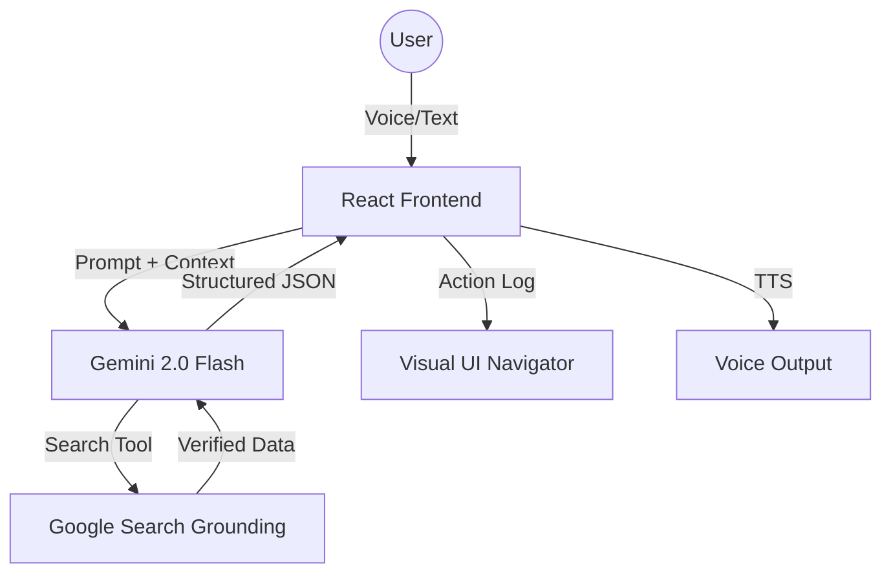

# ☸️ VoiceNav — Universal Web Automation Agent

> **Redefining Interaction: From Static Chatbots to Immersive Visual Agents.**

Built for the **[Gemini Live Agent Challenge](https://gemini.devpost.com/)** under the **UI Navigator** category.

---

## 📺 Demo & Overview

VoiceNav is an elite AI web automation and research agent that becomes the user's hands on the screen. Unlike traditional chatbots that are confined to a text box, VoiceNav **sees** the interface, **understands** visual elements, and **performs** executable actions to bridge the gap between human intent and web interaction.

### 🚀 [Live Demo URL](https://ais-pre-5id4pe5a7v2ttaoqxayill-136118686093.asia-southeast1.run.app)

---

## 💡 The Problem
Most AI agents today are "text-in, text-out." They can tell you how to buy a product or find a flight, but they can't *do* it for you. Users are forced to manually navigate complex UIs, filter results, and verify links themselves.

## ✨ The Solution: VoiceNav
VoiceNav leverages **Gemini 2.0 Flash** and **Multimodal Visual Understanding** to interpret the web as a human does. 
- **Stop Typing, Start Interacting:** Use natural voice commands to trigger complex web workflows.
- **Visual Grounding:** The agent "sees" screenshots and plans actions (CLICK, TYPE, OBSERVE) in real-time.
- **Verified Results:** Integrated with **Google Search Grounding** to ensure every link provided is real, active, and accurate.

---

## 🛠️ Key Features

### 1. ☸️ UI Navigator (Visual Intelligence)
VoiceNav doesn't just scrape data; it understands the UI. It generates a realistic action log including:
- `SCREENSHOT`: Capturing the current view.
- `OBSERVE`: Identifying buttons, inputs, and data.
- `CLICK` & `TYPE`: Simulating navigation and form filling.

### 2. 🎤 Multimodal Interaction
- **Voice-First:** Real-time speech-to-text (STT) using Web Speech API.
- **Agent Persona:** The agent speaks back to you with a distinct, helpful persona using text-to-speech (TTS).
- **Hybrid Input:** A sleek command bar for users who prefer typing.

### 3. 🔍 Google Search Grounding
No more "Page Not Found" errors. VoiceNav uses Gemini's search tool to:
- Verify product availability.
- Retrieve live flight and hotel prices.
- Provide direct, clickable links to major platforms (Amazon, LinkedIn, Google Flights).

### 4. 📊 Real-Time Action Log
Watch the agent's "thought process" as it executes steps. The UI provides a transparent view of every action the agent takes on your behalf.

---

## 🏗️ Architecture

VoiceNav is built with a modern, robust stack designed for the Google Cloud ecosystem:

- **Frontend:** React 19, Tailwind CSS 4, Framer Motion.
- **AI Engine:** Gemini 2.0 Flash (`gemini-2.0-flash`).
- **SDK:** Google GenAI SDK with Search Grounding enabled.
- **Hosting:** Google Cloud Run (Production-ready deployment).
- **Voice:** Web Speech API (Recognition & Synthesis).



---

## ⚙️ Installation & Setup

To run VoiceNav locally:

1. **Clone the repository:**
   ```bash
   git clone https://github.com/your-repo/voicenav.git
   cd voicenav
   ```

2. **Install dependencies:**
   ```bash
   npm install
   ```

3. **Set up Environment Variables:**
   Create a `.env` file in the root:
   ```env
   VITE_GEMINI_API_KEY=your_api_key_here
   ```

4. **Start the development server:**
   ```bash
   npm run dev
   ```

5. **Open the App:**
   Navigate to `http://localhost:3000`. Ensure you grant **Microphone Permissions** when prompted.

---

## 🏆 Hackathon Requirements Checklist

- [x] **Leverage a Gemini model:** Uses `gemini-2.0-flash`.
- [x] **Google GenAI SDK:** Fully integrated for content generation and grounding.
- [x] **Google Cloud Service:** Hosted on Google Cloud Run.
- [x] **UI Navigator Category:** Focuses on visual UI understanding and executable actions.
- [x] **Multimodal:** Uses Audio (Voice), Vision (Simulated Screenshots), and Text.

---

## 👨‍💻 About the Creator
**msusimran20** — Passionate about building the next generation of immersive AI experiences.

---

## 📄 License
MIT License - see the [LICENSE](LICENSE) file for details.

---
*Created for the Gemini Live Agent Challenge 2026.*
